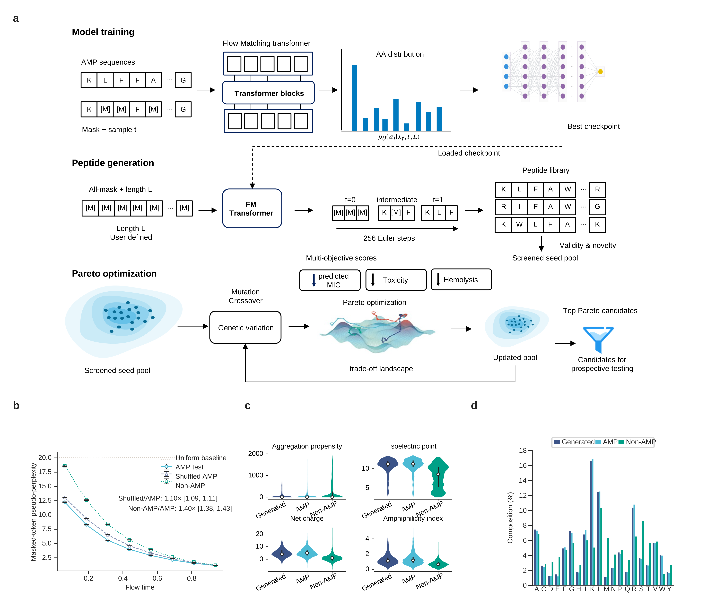

# ApexMO

Antimicrobial peptide design with discrete flow matching and multi-objective
optimization.

ApexMO generates peptides of a specified length, then optimizes for sequences
with lower predicted MIC, toxicity and hemolysis. The repository includes the
training and sampling code, three trained generators, scoring models and the
scripts used to select candidates for experimental testing.



*Figure 1. Model training, peptide generation and Pareto optimization, with
sequence likelihood, physicochemical properties and amino-acid composition
comparisons.*

## Installation

Use a Linux environment with Conda, Git LFS, curl and unzip installed.

```bash
git clone https://github.com/XiaoqiongXia/ApexMO_amp_design.git
cd ApexMO_amp_design
bash scripts/bootstrap.sh
```

The setup script creates the `amp_flow` and `amp_toxinpred3` environments,
downloads model weights and runs installation checks, including small inference
tests. It can be rerun if a download is interrupted. CUDA is used when available;
the default pipeline also supports CPU execution.

## Running the pipeline

Start with the small example to check the installation:

```bash
bash scripts/run_full_pipeline.sh configs/smoke_e2e.yaml
```

This example uses relaxed thresholds to exercise the code. For candidate
selection, review [`configs/pipeline.yaml`](configs/pipeline.yaml) and run:

```bash
bash scripts/run_full_pipeline.sh
```

The default run samples 10–30-residue peptides from three generators and
optimizes a population of 500 sequences across five random seeds for up to
25 generations. APEX scores activity during the search; APEX-pathogen,
ToxinPred3 and HemoPI2 provide additional filters before final selection.
The three search objectives are predicted pathogen MIC, toxicity and hemolysis.

Results are written to `outputs/pipeline/`. The final sequence tables and FASTA
are in `outputs/pipeline/final/04_final/`, with one representative per MMseqs2
cluster at 80% identity and 80% coverage.

For sampling only, stage-by-stage execution and resuming a run, see the
[usage guide](docs/release_code_package_v1_3.md).

## Code and data

| Directory | Contents |
| --- | --- |
| [`src/amp_design/`](src/amp_design/) | Model, training, sampling, scoring and Pareto search |
| [`configs/`](configs/) | Training, sampling and optimization settings |
| [`models/`](models/) | Generator checkpoints and scoring models |
| [`assets/`](assets/) | Training sequences and reference sets |
| [`results/reference_candidates/`](results/reference_candidates/) | Candidate tables from the reference optimization run |
| [`tests/`](tests/) | Unit and integration tests |

See the [model notes](MODEL_CARD.md) for architecture, evaluation metrics and
limitations. All activity and safety scores are predictions; candidate
sequences require experimental validation.

## License

A project-level license has not yet been selected; see
[license status](LICENSE_PENDING.md). Dependencies and external models retain
their own terms, listed in [third-party notices](THIRD_PARTY_NOTICES.md).
